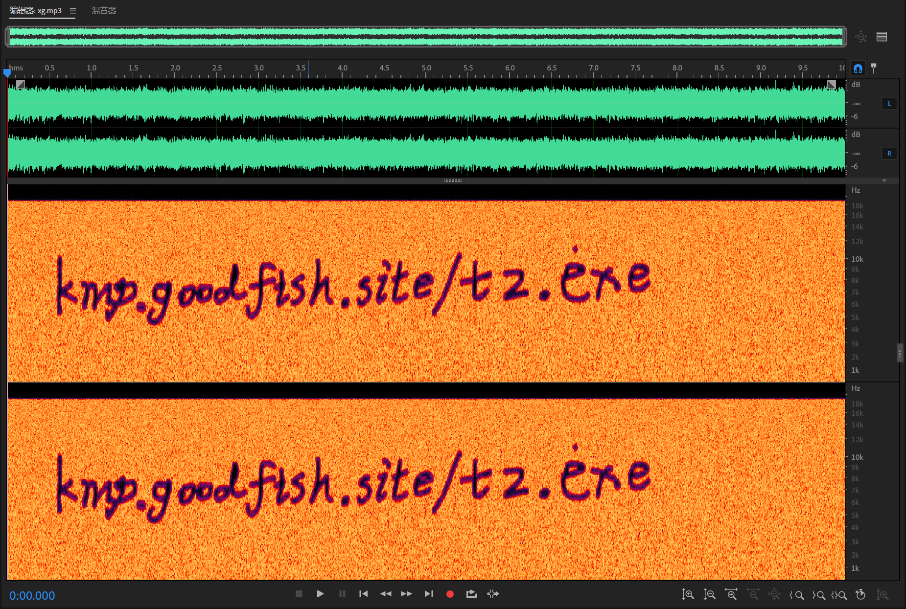
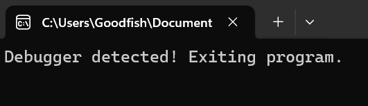
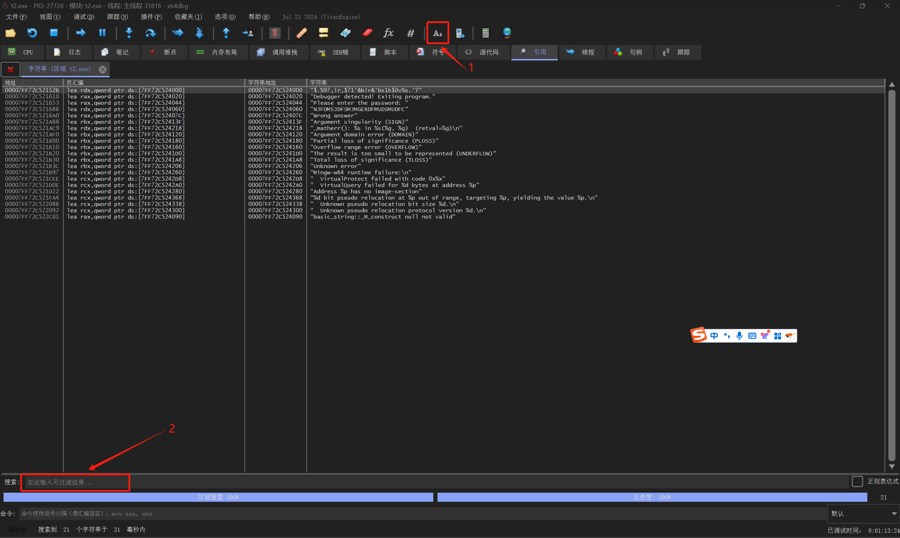

# 小G的照片-Solution

[【点我传送题面】](https://note.goodfish.site/Problems/%E5%B0%8FG%E7%9A%84%E7%85%A7%E7%89%87/)

正如题目背景所言，这道题确确实实是一道套娃题，没有耐心很耐做完

先看给出的图片，题目提到了是用的LSB隐写技术

尝试Stegsolve工具查看，发现没有办法直接读出来

看到提示中的链接，发现其加密方式比较奇怪

不同于常见的LSB隐写方法将整个句子一起转换

这张图片是对于每个字符，通过ASCII转化成二进制后，补全为16位后写入

好在文章直接给出了解密方法，跑一下得到一个音频文件的链接

!!! danger
    音量爆炸，请适当调小音量，不要使用耳机

[https://kmp.goodfish.site/xg.mp3](https://kmp.goodfish.site/xg.mp3)

打开听了一下，发现像是噪声，但是明显有一些起伏变化

因为是噪声，大概率不是MP3Stego一类的工具隐写的

MP3Stego的检测可以看[这篇专利](https://patentimages.storage.googleapis.com/56/b0/75/165d7dd8dcc6ac/CN104282310A.pdf)，给了一种检测的方法（Google的，~~网络不好打不开可以搜专利号`CN104282310A`~~，实测国内可以打开2025-2-13）

既然不是不是MP3Stego，那么拖到Adobe Audition里面看下

波形没有什么特点，放大也看不出来二进制隐藏

既然不是波形，那大概率是频谱了

果然，打开频谱图发现了一个网址

{ loading=lazy }

下载下来放沙盘跑了下，发现要输入密码

随便输了个密码，发现会给一个`Wrong answer`的提示

可前面确实没有什么可以用的的线索，故而用x64dbg尝试爆破

已知的就一个密码错误和一个输入密码的提示，输入密码的提示离判断逻辑太远了

所以主要搜索`Wrong answer`

加载调试器后，发现调试器被Ban了

{ loading=lazy }

程序在正常情况下无法正常运行

在x64dbg中可以使用隐藏调试器的方式饶过检测(调试>高级>隐藏调试器/`hide`命令)

随后不断点击运行按键让程序跑起来

隐藏调试器后程序应当会在等待输入密码的地方停下

这个时候从工具栏可以搜索字符串`Wrong answer`

{ loading=lazy }

双击搜索到的跳转到汇编代码

发现是从一个`je`命令跳转过来的，再往上可以看到一个`test`命令比对

具体的逻辑这里不讲了，密码并没有加密，从右侧注释可以直接看到

??? success
    ```hex
    00007FF72C524060  4E 4A 46 44 4D 53 4A 44 46 53 4D 4A 4D 47 45 52  NJFDMSJDFSMJMGER  
    00007FF72C524070  44 46 4D 55 44 53 4D 55 44 46 43 00 57 72 6F 6E  DFMUDSMUDFC.Wron
    ```

    其中`NJFDMSJDFSMJMGERDFMUDSMUDFC`便是密码

输入后可以得到flg

??? success
    flg是`flg{unc0nfused c0de 1s fr4g1le}`

至于为什么不直接搜索`flg`，这是因为flg经过了加密，无法直接搜索出来。
