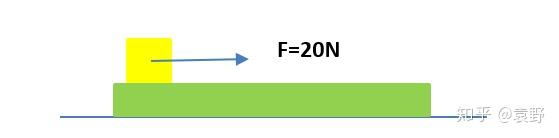
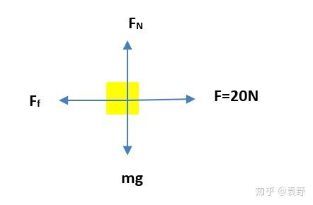
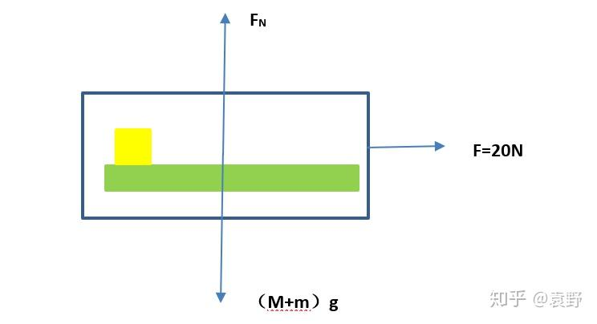

# 力的平衡

## 平衡条件

在讨论具体的平衡分析之前，我们先明确一下对于平衡状态的定义：

> 当两个力作用在同一物体上，如果物体保持静止或匀速直线运动状态，则这两个力的作用效果相互抵消（合力为0），我们就说这两个力平衡。

更进一步可以拓展到多个力的情况，具体来说：

1. 受力情况：和外力和0。

2. 在运动状态上的表现：静止、匀速直线运动和绕轴匀速转动。

当题面出现 **缓慢运动** 等类似字眼时，近似可以看成在任意时刻都没有速度和加速度，方便进行分析。

## 静态平衡

定义：当物体处于 **静止** 或 **匀速直线状态** 时，我们称其处于 **静态平衡** 状态，此时合外力与合力矩均为 $0$ ，即没有平动和转动。

在静态平衡状态下，我们通常通过受力分析解题，具体来说：

在进行受力分析的过程中，一般遵循 **一重、二弹、三摩擦、(四其他)** 的顺序对力进行分析，具体顺序视题目情况而言。

在画出受力分析图后，通过将将不同方向上的力进行分解，化为数个一致方向的力，便于计算合力大小，再根据平衡时合外力为$0$得到力之间的数量关系。

### 整体法与隔离法

当题目中的运动涉及到多个物体时，若依然分别对每个物体进行受力分析，此时我们引入 **整体法与隔离法** 这两种方法来辅助进行分析，接下来将分别进行介绍：

#### 整体法

整体法有时亦称为系统法，在这种方法中，我们将多个物体视为一个整体进行受力分析，并忽略物体之间的内力，仅分析这个整体受到的外部合力，减少了分析的复杂程度。

!!! Waring "适用情况"
    整体法通常用于整体中所有运动物体的加速度相同的情况，如果物体之间有相互运动，那么对于这个整体来说，其某一方向上的作用力合力等于系统内各部分质量分别乘以该方向上的加速度所得积之和，即：
    $$\sum F_{ix} = \sum m_i \cdot a_{ix}\\
    \sum F_{iy} = \sum m_i \cdot a_{iy}$$

##### 例题

这里引用一个知乎专栏中的例子，方便读者理解：

[原文链接](https://zhuanlan.zhihu.com/p/115984850)

在水平光滑的地面上有一质量为 $M = 5 kg$的木板，木板上放置一质量为$m=2kg$的木块，木块受到水平向右$F=20N$的拉力作用，已知木块与木板之间的滑动摩擦系数$\mu=0.5$，求木块和木板的加速度大小分别为多少？（g取 $10 N/kg$）

首先对木块进行受力分析：

在竖直方向上有：

$$F_N = m \cdot g = 20N$$

根据摩擦力公式可以算出摩擦力大小：

$$F_f = \mu \cdot F_N = 10N$$

此时便可以计算出其在水平方向上的合力：

$$F_合 = F - F_f = 10N$$

由牛顿第二定律得到：

$$a = \frac{F_合}{m} = 5 m/s$$

接着对整体进行受力分析：

由整体法牛顿第二定律得到：

$$F = M\cdot a_1 + m \cdot a$$

解得：

$$a_1 = \frac{F-ma}{M} = 2m/s$$

*[受力分析]: 将研究对象看作一个孤立的物体并分析它所受各外力特性的方法。外力又包括主动力和约束力。
