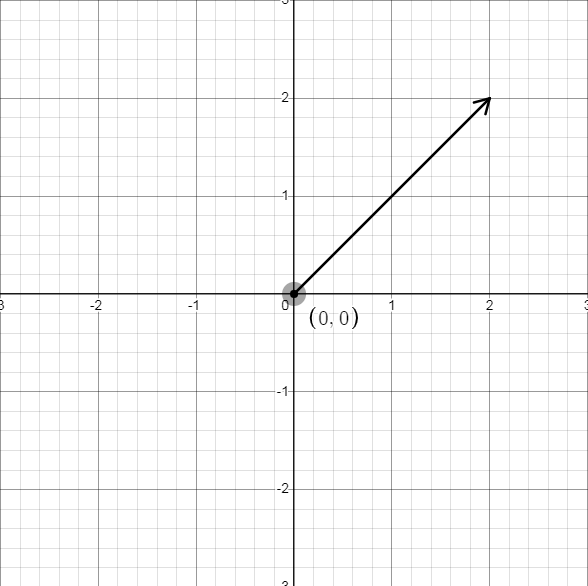
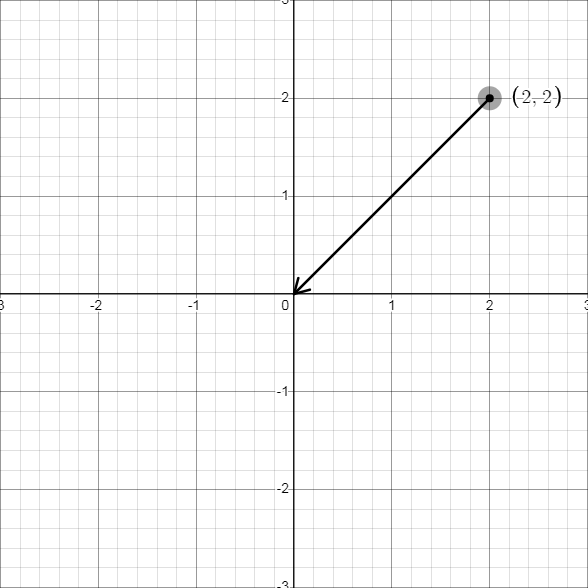
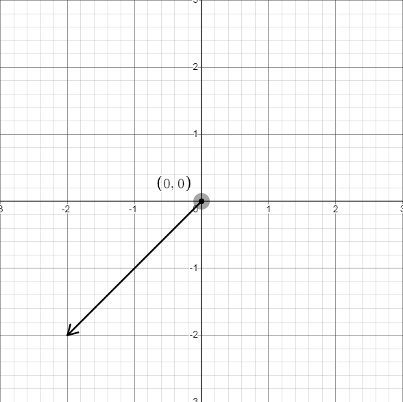

# 向量/矢量

$$\overrightarrow{a}  \vec a$$

??? 翻译问题
    由于一些历史遗留问题，在数学和物理中对于「vector」这一词有不同的翻译。

    在物理学科，一般翻译成「矢量」，同时与「标量」一词相对。而在数学学科，一般翻译成「向量」。这种翻译的差别还有「本征」与「特征」、「幺正」与「酉」，等等。

    在接下来的叙述中，我们统一使用向量，保证较好的阅读观感。

## 向量的定义及相关概念

**向量**：既有大小又有方向的量称为向量。一般情况下我们研究的向量为 **自由向量**，即只要不改变它的大小和方向，起点和终点可以任意平行移动的向量。记作
$\overrightarrow a$ 或 $\vec{a}$ 。

**有向线段**：带有方向的线段称为有向线段。有向线段有三要素：起点，方向，长度，知道了三要素，终点就唯一确定。一般使用有向线段表示向量。

**向量的模**：有向线段
$\overrightarrow{AB}$ 的长度称为向量的模，即为这个向量的大小。记为：
$|\overrightarrow{AB}|$ 或 $|\vec{a}|$ 。

**零向量**：模为 $0$ 的向量。零向量的方向任意。记为：
$\overrightarrow 0$ 或 $\vec{0}$ 。

**单位向量**：模为 $1$ 的向量称为该方向上的单位向量。一般记为
$\overrightarrow e$ 或 $\vec{e}$ 。

**平行向量**：方向相同或相反的两个 非零 向量。记作： $\overrightarrow a\parallel \overrightarrow b$ 。对于多个互相平行的向量，可以任作一条直线与这些向量平行，那么任一组平行向量都可以平移到同一直线上，所以平行向量又叫 共线向量。

**相等向量**：模相等且方向相同的向量。

**相反向量**：模相等且方向相反的向量。

**向量的夹角**：已知两个非零向量 $\overrightarrow a,\overrightarrow b$ ，作
$\overrightarrow{OA}=\overrightarrow a,\overrightarrow{OB}=\overrightarrow b$ ，那么 $\theta=\angle AOB$ 就是向量 $\overrightarrow a$ 与向量 $\overrightarrow b$ 的夹角。记作： $\langle \overrightarrow a,\overrightarrow b\rangle$ 。显然当 $\theta=0$ 时两向量同向， $\theta=\pi$ 时两向量反向，
$\theta=\frac{\pi}{2}$ 时两向量垂直，记作 $\overrightarrow a\perp \overrightarrow b$ ，并且规定 $\theta \in [0,\pi]$ 。

注意到平面向量具有方向性，两个向量不能比较大小（但可以比较两向量的模长）。但是两个向量可以相等。

## 向量的运算

### 向量的加减法

在定义了一种量之后，就希望让它具有运算。向量的运算可以类比数的运算，从物理学的角度出发也可以研究向量的运算。

类比物理学中的位移概念，一个人从 $A$ 经 $B$ 走到 $C$，那么他经过的位移为$\overrightarrow{AB}+\overrightarrow{BC}$，这其实等价于这个人直接从 $A$ 走到 $C$，即

$$ \overrightarrow{AB} + \overrightarrow{BC} = \overrightarrow{AC} $$

> 上述的公式不要求两向量在同一直线上，即在$A$点和$C$点固定时，$B$点位置的改变并不会影响到最终的和。

通过上述的例子，相信读者不难想到物理中力的合成法则 **平行四边形法则** ，其本质即为向量的相加（力即为向量）。由此，我们便可以得到向量的加法法则：

1. **向量加法的三角形法则** ：若要求和的向量首尾顺次相连，那么这些向量的和为第一个向量的起点指向最后一个向量的终点；

2. **向量加法的平行四边形法则** ：若要求和的两个向量 共起点，那么它们的和向量为以这两个向量为邻边的平行四边形的对角线，起点为两个向量共有的起点，方向沿平行四边形对角
线方向。

无论是 **三角形法则** 还是 **平行四边形法则** 若要求和的两个向量位置不满足上述设定，我们可以通过平移的方式改变位置，平移 **自由向量** 并不会影响到运算结果。

这样，向量的加法就具有了几何意义。并且可以验证向量的加法满足 **交换律与结合律**。

因为实数的减法可以写成加上相反数的形式，考虑在向量做减法时也这么写。即：

$$\overrightarrow a-\overrightarrow b=\overrightarrow a+(-\overrightarrow b)$$

这样，考虑共起点的向量，按照平行四边形法则做出它们的差，经过平移后可以发现 「共起点向量的差向量」是由「减向量」指向「被减向量」的有向线段。这也是向量减法的几何意义。

??? Warning "常见误区"
    $-\overrightarrow a$与$\overrightarrow a$的区别在于 **方向相反** 。但需要注意 **方向相反** 指的是向量的起点与终点相反，而非只改变终点。具体来说，在下方三张图片中，第一张为原向量，第二张为正确演示。第三张为错误演示。

    {:width="200px"}
    {:width="200px"}
    {:width="200px"}

有时候有两点 A,B，想知道 $\overrightarrow{AB}$，可以利用减法运算获得：

$$\overrightarrow{AB}=\overrightarrow{OB}-\overrightarrow{OA} $$

### 向量的数乘

规定「实数 $\lambda$ 与向量 $\overrightarrow a$ 的积」为一个向量，这种运算就是向量的 数乘运算，记作 $\lambda \overrightarrow a$，它的长度与方向规定如下：

$$|\lambda \overrightarrow a|=|\lambda||\overrightarrow a|$$

当 $\lambda >0$ 时，$\lambda\overrightarrow a$ 与 $\overrightarrow a$ 同向，当 $\lambda = 0$ 时，$\lambda \overrightarrow a=\overrightarrow 0$，当 $\lambda<0$ 时，$\lambda \overrightarrow a$ 与 $\overrightarrow a$ 方向相反。

根据数乘的定义，可以验证有如下运算律：

\begin{aligned}
\lambda(\mu \overrightarrow a)&=(\lambda \mu)\overrightarrow a\\
(\lambda+\mu)\overrightarrow a&=\lambda \overrightarrow a+\mu \overrightarrow a\\
\lambda(\overrightarrow a+\overrightarrow b)&=\lambda \overrightarrow a+\lambda \overrightarrow b
\end{aligned}

特别地：

\begin{gathered}
(-\lambda)\overrightarrow a=-(\lambda \overrightarrow a)=-\lambda(\overrightarrow a)\\
\lambda(\overrightarrow a-\overrightarrow b)=\lambda \overrightarrow a-\lambda \overrightarrow b
\end{gathered}

### 判定两向量共线

两个 **非零** 向量 $\overrightarrow a$ 与 $\overrightarrow b$ 共线 $\iff$ 有唯一实数 $\lambda$，使得 $\overrightarrow b=\lambda \overrightarrow a$。

证明：由数乘的定义可知，对于 **非零** 向量 $\overrightarrow a$，如果存在实数 $\lambda$，使得 $\overrightarrow b=\lambda \overrightarrow a$，那么 $\overrightarrow a \parallel \overrightarrow b$。

反过来，如果 $\overrightarrow a\parallel \overrightarrow b，\overrightarrow a \not = \overrightarrow 0$，且 $|\overrightarrow b|=\mu |\overrightarrow a|$，那么当 $\overrightarrow a$ 与 $\overrightarrow b$ 同向时，$\overrightarrow b=\mu \overrightarrow a$，反向时 $\overrightarrow b=-\mu \overrightarrow a$。

最后，向量的加，减，数乘统称为向量的线性运算。

??? 翻译问题
    由于历史原因，数学学科和物理学科关于「inner product」和「outer product」两个词汇有着五花八门的翻译。

    在物理学科，一般翻译成「标积」和「矢积」，表示运算的结果为标量和矢量。高中数学课本上「数量积」和「向量积」也采用了这种意译的办法。

    在数学学科，通常也可以翻译成「内积」和「外积」，是两个名词的直译。「点乘」和「叉乘」是根据运算符号得来的俗称，这种俗称也很常见。

    在「点乘」运算中，经常省略运算的点符号，在线性代数中更是会直接看作矩阵乘法，不写点符号。

### 内积/点乘/标积/数量积

内积的概念 **对于任意维数的向量都适用**。

内积有不同但等价的定义方法，下面介绍其中一些。

**几何定义** ：在 $n$ 维欧氏空间 $\mathbf{R}^n$ 下，已知两个向量 $\overrightarrow a, \overrightarrow b$ ，它们的夹角为 $\theta$ ，那么：

$$\overrightarrow a \cdot \overrightarrow b = |\overrightarrow a| |\overrightarrow b| \cos \theta$$

就是这两个向量的 **内积** ，也叫 **点积** 或 **数量积** 。其中称 $|\overrightarrow b|\cos \theta$ 为 $\overrightarrow b$ 在 $\overrightarrow a$ 方向上的投影。内积的几何意义即为：内积 $\overrightarrow a \cdot \overrightarrow b$ 等于 $\overrightarrow a$ 的模与 $\overrightarrow b$ 在 $\overrightarrow a$ 方向上的投影的乘积。

**代数定义** ：在 $n$ 维欧氏空间 $\mathbf{R}^n$ 下，已知两个向量 $\overrightarrow a = (a_1, a_2, \dots, a_n), \overrightarrow b = (b_1, b_2, \dots, b_n)$ ，那么：

$$\overrightarrow a \cdot \overrightarrow b = \sum_{i = 1}^{n} a_i b_i$$

就是这两个向量的 **内积** ，也叫 **点积** 或 **数量积**。

!!! Danger
    内积的几何定义与代数定义在欧氏空间下是等价的，而后者在数学中较为常用，其在计算高多维度向量时更简单。但在物理竞赛中，低维度向量更常见，所以通常使用几何定义进行理解与计算。

在不引起混淆的情况下，内积的点号可以省略不写。如果在向量的右上角有上角标 $2$ ，表示向量与自身内积的简写，即 向量模长的平方，省略模长记号。该上角标 $2$ 不可以理解为向量的平方，这是因为，向量内积的结果为标量，不存在除了 $2$ 以外任何个数的向量的内积。同理，向量模长平方的平方，不可以简写为上角标 $4$ ，而是必须将上角标 $2$ 的结果视为一个整体，举个例子：

\begin{align*}
(\overrightarrow a)^2&=\overrightarrow a \cdot \overrightarrow a \\
(\overrightarrow a)^4 &\ne \overrightarrow a \cdot \overrightarrow a \cdot \overrightarrow a \cdot \overrightarrow a &(\text{错误写法})\\
((\overrightarrow a)^2)^2 &= \overrightarrow a \cdot \overrightarrow a \cdot \overrightarrow a \cdot \overrightarrow a &(\text{正确写法})\\
\end{align*}

可以发现，内积得到的结果是一个标量，其特别之处在于，它是关于两个向量分别都线性的双线性运算。具体而言，内积满足：

\begin{aligned}
(\overrightarrow a + \overrightarrow b) \cdot \overrightarrow c &= \overrightarrow a \cdot \overrightarrow c + \overrightarrow b \cdot \overrightarrow c \\
\overrightarrow a \cdot (\overrightarrow b + \overrightarrow c) &= \overrightarrow a \cdot \overrightarrow b + \overrightarrow a \cdot \overrightarrow c \\
(\lambda \overrightarrow a) \cdot \overrightarrow b &= \lambda (\overrightarrow a \cdot \overrightarrow b) \\
\overrightarrow a \cdot (\lambda \overrightarrow b) &= \lambda (\overrightarrow a \cdot \overrightarrow b)
\end{aligned}

内积还满足交换律，即：

$$\overrightarrow a \cdot \overrightarrow b = \overrightarrow b \cdot \overrightarrow a$$

下面介绍内积运算的一些常见应用。

1.判定两向量垂直：

$$ \overrightarrow a \perp \overrightarrow b \iff \overrightarrow a \cdot \overrightarrow b = 0 $$

 即互相垂直的两个向量的内积，结果为 $0$ ；向量与零向量内积，结果为 $0$ 。如果使用内积为零作为垂直的定义，则可以得出零向量与任何向量都垂直。

2.判定两向量共线：

$$ \exists\lambda \in \mathbf{R} (\overrightarrow a = \lambda \overrightarrow b) \iff |\overrightarrow a \cdot \overrightarrow b| = |\overrightarrow a| |\overrightarrow b| $$

3.计算向量的模：

$$ |\overrightarrow a| = \sqrt{\overrightarrow a \cdot \overrightarrow a} $$

4.计算两向量的夹角：

$$ \theta = \arccos \frac{\overrightarrow a \cdot \overrightarrow b}{|\overrightarrow a| |\overrightarrow b|} $$

### 外积/叉乘/矢积/向量积

外积有不同但等价的定义方法，下面介绍其中一些。

**几何定义**：在三维欧氏空间 $\mathbf{R}^3$ 下，定义向量 $\overrightarrow a, \overrightarrow b$ 的外积为一个向量，记为 $\overrightarrow a \times \overrightarrow b$ ，其模与方向定义如下：

1. $|\overrightarrow a \times \overrightarrow b| = |\overrightarrow a| |\overrightarrow b| \sin \langle \overrightarrow a, \overrightarrow b \rangle$；

2. $\overrightarrow a \times \overrightarrow b$ 与 $\overrightarrow a, \overrightarrow b$ 都垂直，且 $\overrightarrow a, \overrightarrow b, \overrightarrow a \times \overrightarrow b$ 的方向符合右手法则。

注意到外积的模，联想到三角形面积计算公式 $S=\frac{1}{2}ab\sin C$ ，可以发现外积的几何意义是： $|\overrightarrow a \times \overrightarrow b|$ 是以 $\overrightarrow a, \overrightarrow b$ 为邻边的平行四边形的面积。

**代数定义**：在三维欧氏空间 $\mathbf{R}^3$ 下，定义向量 $\overrightarrow a = (x_1, y_1, z_1), \overrightarrow b = (x_2, y_2, z_2)$ 的外积为一个向量 $\overrightarrow c$ ，记作 $\overrightarrow c = \overrightarrow a \times \overrightarrow b$ ，其结果可以使用三阶行列式表示：

\begin{vmatrix}
\overrightarrow i & \overrightarrow j & \overrightarrow k \\
x_1 & y_1 & z_1 \\
x_2 & y_2 & z_2
\end{vmatrix}

其中 $\overrightarrow i, \overrightarrow j, \overrightarrow k$ 表示朝向为坐标轴 $x, y, z$ 的单位向量，并写在对应坐标处。展开得

\begin{aligned}
\overrightarrow c &= \overrightarrow a \times \overrightarrow b \\ &= (y_1z_2 - y_2z_1)\overrightarrow i + (z_1x_2 - z_2x_1)\overrightarrow j + (x_1y_2 - x_2y_1)\overrightarrow k \\
&= (y_1z_2 - y_2z_1, z_1x_2 - z_2x_1, x_1y_2 - x_2y_1)
\end{aligned}

下面介绍内积运算的一些常见性质。

外积是关于两个向量分别都线性的双线性运算。具体而言，外积满足：

\begin{aligned}
(\overrightarrow a + \overrightarrow b) \times \overrightarrow c &= \overrightarrow a \times \overrightarrow c + \overrightarrow b \times \overrightarrow c \\
\overrightarrow a \times (\overrightarrow b + \overrightarrow c) &= \overrightarrow a \times \overrightarrow b + \overrightarrow a \times \overrightarrow c \\
(\lambda \overrightarrow a) \times \overrightarrow b &= \lambda (\overrightarrow a \times \overrightarrow b) \\
\overrightarrow a \times (\lambda \overrightarrow b) &= \lambda (\overrightarrow a \times \overrightarrow b)
\end{aligned}

前两行性质亦可称为分配律，即外积对于向量加法满足乘法分配律。

外积满足反交换律，即：

$$ \overrightarrow a \times \overrightarrow b=-\overrightarrow b \times \overrightarrow a $$

根据上文内积与外积的几何定义：

\begin{aligned}
|\overrightarrow a \times \overrightarrow b| &= |\overrightarrow a| |\overrightarrow b| \sin \langle \overrightarrow a, \overrightarrow b \rangle \\
\overrightarrow a \cdot \overrightarrow b &= |\overrightarrow a| |\overrightarrow b| \cos \theta \\
&= |\overrightarrow a| |\overrightarrow b| \cos \langle \overrightarrow a, \overrightarrow b\rangle
\end{aligned}

可以写出恒等式：

$$ (\overrightarrow a\times \overrightarrow b) \cdot (\overrightarrow a\times \overrightarrow b) = |\overrightarrow a|^2 |\overrightarrow b|^2-{(\overrightarrow a \cdot \overrightarrow b)}^2 $$

外积满足 Jacobi 恒等式：

$$ \overrightarrow a \times (\overrightarrow b \times \overrightarrow c) + \overrightarrow b \times (\overrightarrow c \times \overrightarrow a) + \overrightarrow c \times (\overrightarrow a \times \overrightarrow b) = \overrightarrow 0 $$

下面介绍外积运算的一些常见应用。

1.判定两向量是否共线：

$$ \exists\lambda \in \mathbf{R} (\overrightarrow a = \lambda \overrightarrow b) \iff \overrightarrow a \times \overrightarrow b = \overrightarrow 0 $$

即共线的两个三维向量的外积，结果为 $\overrightarrow 0$ ；三维向量与自身外积，结果为 $\overrightarrow 0$ ；三维向量与零向量外积，结果为 $\overrightarrow 0$ 。若使用外积为零作为两向量共线的定义，则可以得出零向量与任何向量都共线。

2.计算两向量张成的平行四边形面积：

$$ S \langle \overrightarrow a, \overrightarrow b \rangle = |\overrightarrow a \times \overrightarrow b| $$

**二维向量的情形**：对于二维向量，无法计算外积，但是仍然可以计算两向量张成的平行四边形面积：

记 $\overrightarrow a = (m, n), \overrightarrow b = (p, q)$ ，将平面直角坐标系扩充为空间直角坐标系，原平面位于新坐标系的 $xOy$ 平面，原本的坐标 $(m, n)$ 和 $(p, q)$ 变为 $(m, n, 0)$ 和 $(p, q, 0)$ 。

那么两个向量的外积为 $(0, 0, mq - np)$ ，因此平行四边形的面积为 $|mq - np|$ ，可以视为二阶行列式运算结果的绝对值。

此时，根据右手法则和 $z$ 坐标的符号，可以推断出 $\overrightarrow b$ 相对于 $\overrightarrow a$ 的方向，若在逆时针方向则 $z$ 坐标为正值，反之为负值，简记为 **顺负逆正**。
