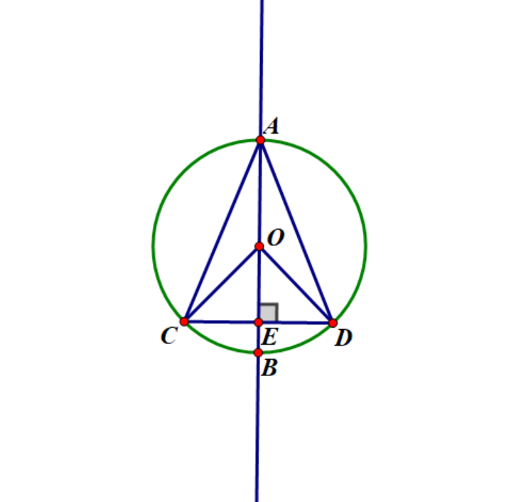

# 圆

## 1. 圆的定义和基本元素

- **定义（集合性定义）**：在平面内，圆是到定点（圆心）距离为定长（半径）的点的集合。

- **符号**：通常用$\odot$表示圆。

- **基本元素**：
  - **圆心**：圆内一点，到圆上任意点的距离均相等。
  - **弦**：圆上任意两点间的连线（线段）。
  - **圆心角**：顶点在圆心的角。
  - **圆周角**：顶点在圆周上的角。
  - **直径**：通过圆心的弦，是圆中最长的弦。
  - **半径**：从圆心到圆上任意一点的线段。
  - **弧**：圆上任意两点之间的部分。
  
- **对称性**：
  - **轴对称**：对称轴为直径，有无数条对称轴。
  - **中心对称**：对称中心为圆心。
  - **旋转对称**：绕圆心旋转任意角度后，图形与原图形重合。

## 2. 垂径定理

- **原理**：圆是轴对称图形。

- **内容**：
  - 垂直于弦的直径，必然平分该弦。
  - 平分弦的直径，必然垂直于该弦。
  
- **推论**：
  - 垂径平分弦对应的优弧和劣弧。
  - **知二求四**（已知以下任意两个条件，可推导出其他四个）：
    - $AB$ 为直径
    - $AB \perp CD$
    - $AB$ 平分 $CD$
    - $AB$ 平分 $CD$ 对应的劣弧
    - $AB$ 平分 $CD$ 对应的优弧
    - $OB$ 为 $\angle COD$ 的角平分线
    - $AB$ 为 $\angle CAD$ 的角平分线

{:width="200px"}

## 3. 圆心角定理

- **内容**：

  - 在同圆或等圆中，相等的圆心角所对的弦相等。
  
    - 例：如图，$\alpha$ 与 $\beta$ 互为对顶角（$AD$ 与 $BC$ 交于 $O$），则 $\alpha = \beta$，因此 $AB = CD$。

  - 在同圆或等圆中，圆心角所对的弧长与圆心角成正比：
  
    - 弧度制：弧长 = 圆心角 × 半径（即 $ l = \alpha \cdot r $）。

    - 角度制：弧长 = $ \frac{\alpha}{360^\circ} \times \text{周长} $（即 $ l = \frac{\alpha}{360^\circ} \cdot 2\pi r $）。

{:width="200px"}

## 4. 圆周角定理

- **定义**：同弧所对的圆周角等于该弧所对圆心角的一半。

  - 例：$ \angle ACB = \frac{1}{2} \angle AOB $。
  
- **互补弧对应圆周角互补**：如果两个圆周角对应互补弧，则这两个角互补。

  - 例：$ \angle ACB + \angle ADB = 180^\circ $。
  
{:width="200px"}

- **推论**：
  
  **直径所对的圆周角是直角**（90°）。
  
  - 例：$ \angle ACB = 90^\circ = \angle ADB $（如图，三角形内接于圆，且 AB 为直径）。

  **同弧所对的圆周角相等**；在等圆中，相等的圆周角所对的弧相等。
  
  - 例：如果 $ \angle C = \angle D $，则弧 CB = 弧 DB。

## 5. 圆内接四边形

- **定义**：四个顶点都在圆上的四边形。

- **性质**：
  
  **对角互补**：圆内接四边形的对角之和为 180°。
  
  - 例：$ \angle BAD + \angle BCD = 180^\circ $，$ \angle ABC + \angle ADC = 180^\circ $。
  
  **外角性质**：一个角的外角等于其内对角。
  
  - 例：如图，点 E 在四边形 ABCD 外，则 $ \angle PAE = \angle C $。
