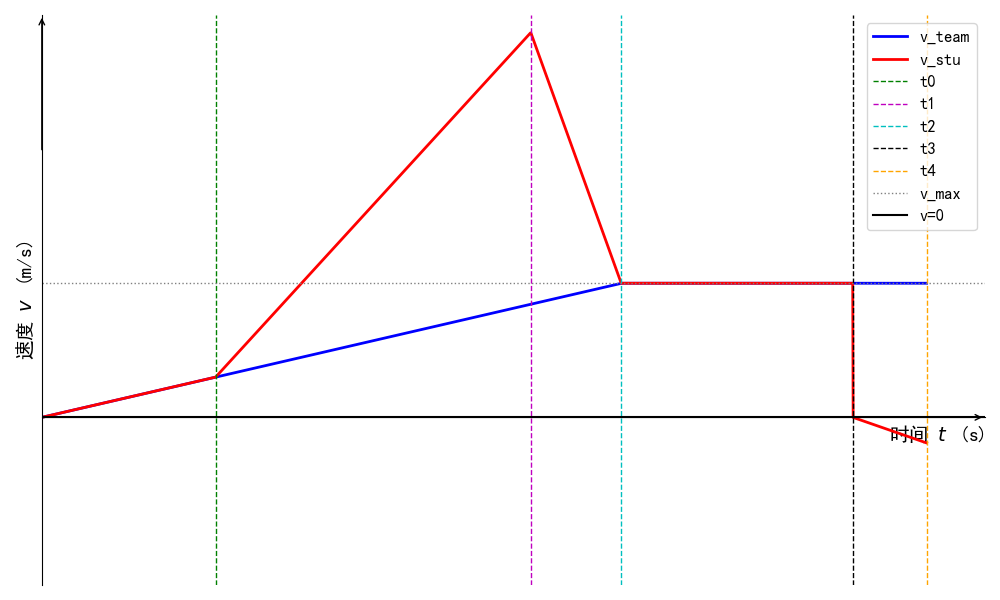

# 运动学问题杂谈

本文将从数个常见的运动学问题为抓手，通过例题以及概念讲解的方式，让读者对具体知识点的考察方式有所了解，了解常见套路。

## 又是一年军训

### 题面

在学校组织的军训展示环节中，某班级排成一条长度为 $L$ 的队列（从队尾到队首的距离为 $L$），最初全体同学保持静止。

队列在老师的口令下，以恒定加速度 $a_{team}$ 做匀加速运动，直至达到最大速度 $v_{\max}$，随后保持该匀速。

作为通讯兵的小明最开始在队尾等待信号。信号在 $t_0$ 后才传到他手中，此时队列仍在加速阶段。

小明收到信号后立即向队首奔去，追上队首后，此时队列恰好开始以 $v_{\max}$ 的速度前行，小明保持同样的速度与队伍一同前行，小明需要花 $\Delta t$ 与队长交接信息。

小明在队首与队长交接信息完成后立即掉头返回队尾。返回阶段以加速度 $a_{stu}^{\prime}$ 向后加速（初始速度为 $0$），直至追上队尾。设小明于$t_4$返回队首。

具体来说，小明的运动过程如下：

- $0 \le t < t_0$ 时，小明从静止开始做匀加速运动，加速度为 $a_{team}>0$。
- $t_0\le t < t_1$ 时，小明从原速度开始做匀加速运动，加速度为 $a_{stu}>0$。
- $t_1\le t < t_2$ 时，小明从原速度开始做匀减速运动，加速度为 $a_{stu}^{\prime}<0$。
- $t_2\le t < t_3,(t_3 = t_2+\Delta t)$ 时，小明以速度 $v_{\max}$ 做匀速运动。
- $t_3\le t < t_4$ 时，小明从静止开始做匀加速运动（反向），加速度为$a_{stu}^{\prime} < 0$。

你需要使用 $a_{team}, t_0, a_{stu}^{\prime}, v_{\max}, a_{stu}, \Delta t$ 表示下述内容

1. 小明在第 1 段与第 2 段运动的分界时刻 $t_1$（$t_0<t_1<t_2$）以及第 2 段结束时刻 $t_2$。  
2. 队列的长度 $L$。  
3. 小明完成一次往返（从队尾到队首再返回队尾）所需的总时间 $t_4$。

### 解析

本题固然可以通过求图像中面积的方式求解，但并不方便，不妨让我们考虑使用解析几何来解决这个问题。

具体来说，我们可以使用分段函数来表示队伍和小明的速度变化。

由题可知，队伍的函数如下：

$$v_{team} = \begin{cases}
t\cdot a_{team},\quad 0\le t \le \frac{v_{\max}}{a_{team}}\\
v_{\max}, \quad \frac{v_{\max}}{a_{team}} < t
\end{cases}$$  

接下来我们分段考虑小明的运动情况：

$0\le t < t_0 $ 时，小明与队列一同行进，其速度也与队列相同：

$$v_{stu} = t \cdot a_{team}, \quad 0\le t < t_0$$

$ t_0 \le t < t_1 $时，小明加速向前，对于这一段函数，我们知道其斜率$a_{stu}$ 以及其$t_0$时的坐标 $(t_0,t_0\cdot a_{team})$，即可得到函数解析式，过程如下：

$$v_{stu} = t \cdot a_{stu} +b , \quad t_0 \le t < t_1$$

令 $t = t_0, \quad v = t_0 \cdot a_{team}$，解得：

$$v_{stu} = t \cdot a_{stu} + t_0 \cdot (a_{team}-a_{stu}) , \quad t_0 \le t < t_1 $$

$ t_1 \le t < t_2 $时，小明减速追上队首，我们同样知道这段函数的斜率 $a_{stu}^{\prime}$ 以及其 $t_1$ 时的坐标 $(t_1,t_1\cdot a_{stu} + t_0 \cdot (a_{team}-a_{stu}))$ ，为了求出这段函数的解析式，我们需要先求出$t_2$。

根据题意，小明在$t_2$时刻追上队首，此时队列开始以$v_{\max}$匀速行进，因此$t_2$就是队列达到最大速度的时刻：

$$t_2 = \frac{v_{\max}}{a_{team}}$$

现在我们可以求出$t_1$。在$t_1$时刻，小明追上队首，此时小明和队首的位置相同。我们需要通过位移关系来求解$t_1$。

首先，我们计算队首在$t_0$到$t_2$期间的位移。队首的运动分为两段：
1. $0 \le t < t_0$：从静止开始以加速度$a_{team}$加速
2. $t_0 \le t < t_2$：继续以加速度$a_{team}$加速直到达到$v_{\max}$

队首在$t_0$时刻的速度为$v_{team}(t_0) = t_0 \cdot a_{team}$，在$t_2$时刻的速度为$v_{\max}$。

队首在$t_0$到$t_2$期间的位移为：
$$\begin{align}
x_{team} &= v_{team}(t_0) \cdot (t_2 - t_0) + \frac{1}{2} a_{team} \cdot (t_2 - t_0)^2\\
x_{team} &= t_0 \cdot a_{team} \cdot (t_2 - t_0) + \frac{1}{2} a_{team} \cdot (t_2 - t_0)^2\\
x_{team} &= \frac{1}{2} a_{team} \cdot (t_2 - t_0)^2 + t_0 \cdot a_{team} \cdot (t_2 - t_0)\\
x_{team} &= \frac{1}{2} a_{team} \cdot (t_2 - t_0) \cdot (t_2 - t_0 + 2t_0\\
x_{team} &= \frac{1}{2} a_{team} \cdot (t_2 - t_0) \cdot (t_2 + t_0)
\end{align}$$

小明在$t_0$到$t_1$期间的位移为：

$$\begin{align}
x_{stu1} &= v_{stu}(t_0) \cdot (t_1 - t_0) + \frac{1}{2} a_{stu} \cdot (t_1 - t_0)^2\\
x_{stu1} &= t_0 \cdot a_{team} \cdot (t_1 - t_0) + \frac{1}{2} a_{stu} \cdot (t_1 - t_0)^2
\end{align}$$

小明在$t_1$到$t_2$期间的位移为：
$$x_{stu2} = v_{stu}(t_1) \cdot (t_2 - t_1) + \frac{1}{2} a_{stu}^{\prime} \cdot (t_2 - t_1)^2$$

其中$v_{stu}(t_1) = t_1 \cdot a_{stu} + t_0 \cdot (a_{team} - a_{stu})$

现在我们来求解$t_1$。在$t_1$时刻，小明追上队首，意味着小明的总位移等于队首的位移加上队列的初始长度$L$：

$$x_{stu1} + x_{stu2} = x_{team} + L$$

其中：
- $x_{stu1}$是小明在$t_0$到$t_1$期间的位移
- $x_{stu2}$是小明在$t_1$到$t_2$期间的位移
- $x_{team}$是队首在$t_0$到$t_2$期间的位移

将前面的公式代入，我们得到：
$$t_0 \cdot a_{team} \cdot (t_1 - t_0) + \frac{1}{2} a_{stu} \cdot (t_1 - t_0)^2 + v_{stu}(t_1) \cdot (t_2 - t_1) + \frac{1}{2} a_{stu}^{\prime} \cdot (t_2 - t_1)^2 = \frac{1}{2} a_{team} \cdot (t_2 - t_0) \cdot (t_2 + t_0) + L$$

整理得到：
$$t_0 \cdot a_{team} \cdot (t_1 - t_0) + \frac{1}{2} a_{stu} \cdot (t_1 - t_0)^2 + (t_1 \cdot a_{stu} + t_0 \cdot (a_{team} - a_{stu})) \cdot (t_2 - t_1) + \frac{1}{2} a_{stu}^{\prime} \cdot (t_2 - t_1)^2 = \frac{1}{2} a_{team} \cdot (t_2^2 - t_0^2) + L$$

将$t_2 = \frac{v_{\max}}{a_{team}}$代入，并解出$t_1$：

$$t_1 = \frac{v_{\max} - \sqrt{v_{\max}^2 - 2(a_{stu} - a_{team})(t_2-t_0)v_{\max} + (a_{stu}-a_{team})^2(t_2-t_0)^2 + 2(a_{stu}-a_{team})L}}{a_{stu}-a_{team}} + t_0$$

$t_2 \le t < t_3 $ 时，此时小明与队伍同时保持$v_{\max}$行进，则：

$$v_{stu} = v_{\max}, \quad t_2 \le t < t_3$$

$t_3 \le t < t_4 $ 时，小明加速返回队尾，此时小明的初始速度为$0$（相对于队伍），加速度为$a_{stu}^{\prime}$：

$$v_{stu} = (t - t_3) \cdot a_{stu}^{\prime}, \quad t_3 \le t < t_4$$

现在我们需要求解队列长度$L$和总时间$t_4$。

对于队列长度$L$，根据前面的位移关系方程，我们可以解出$L$：

$$L = t_0 \cdot a_{team} \cdot (t_1 - t_0) + \frac{1}{2} a_{stu} \cdot (t_1 - t_0)^2 + (t_1 \cdot a_{stu} + t_0 \cdot (a_{team} - a_{stu})) \cdot (t_2 - t_1) + \frac{1}{2} a_{stu}^{\prime} \cdot (t_2 - t_1)^2 - \frac{1}{2} a_{team} \cdot (t_2^2 - t_0^2)$$

这个表达式可以进一步简化。将$t_2 = \frac{v_{\max}}{a_{team}}$代入，我们得到：

$$L = t_0 \cdot a_{team} \cdot (t_1 - t_0) + \frac{1}{2} a_{stu} \cdot (t_1 - t_0)^2 + (t_1 \cdot a_{stu} + t_0 \cdot (a_{team} - a_{stu})) \cdot (\frac{v_{\max}}{a_{team}} - t_1) + \frac{1}{2} a_{stu}^{\prime} \cdot (\frac{v_{\max}}{a_{team}} - t_1)^2 - \frac{1}{2} a_{team} \cdot (\frac{v_{\max}^2}{a_{team}^2} - t_0^2)$$

整理得到：
$$L = \frac{1}{2} a_{stu} \cdot (t_1 - t_0)^2 + (t_1 \cdot a_{stu} + t_0 \cdot (a_{team} - a_{stu})) \cdot (\frac{v_{\max}}{a_{team}} - t_1) + \frac{1}{2} a_{stu}^{\prime} \cdot (\frac{v_{\max}}{a_{team}} - t_1)^2 - \frac{v_{\max}^2}{2a_{team}}$$

接下来我们求解小明完成一次往返所需的总时间$t_4$。

在$t_3$时刻，小明开始返回队尾。此时小明相对于队伍的速度为$0$，然后以加速度$a_{stu}^{\prime}$向后加速。

小明返回时的速度函数为：
$$v_{stu} = (t - t_3) \cdot a_{stu}^{\prime}, \quad t_3 \le t < t_4$$

小明返回时的位移函数为（以$t_3$时刻的位置为起点）：
$$x_{stu}^{(return)} = \frac{1}{2} a_{stu}^{\prime} \cdot (t - t_3)^2, \quad t_3 \le t < t_4$$

在$t_3$到$t_4$期间，队尾继续向前运动。队尾的速度函数需要分段考虑：

1. 在$0 \le t < t_2$期间，队尾以加速度$a_{team}$加速，速度函数为：
   $$v_{team}^{(tail)} = t \cdot a_{team}, \quad 0 \le t < t_2$$

2. 在$t_2 \le t$期间，队尾以速度$v_{\max}$匀速运动：
   $$v_{team}^{(tail)} = v_{\max}, \quad t_2 \le t$$

因此，在$t_3 \le t < t_4$期间，队尾的位移函数为（以$t_3$时刻的位置为起点）：
$$x_{team}^{(tail)} = v_{\max} \cdot (t - t_3) + \frac{1}{2} a_{team} \cdot (t - t_3)^2, \quad t_3 \le t < t_4$$

当小明返回队尾时，他的位移等于队尾的位移加上队列长度$L$：
$$x_{stu}^{(return)} = x_{team}^{(tail)} + L$$

即：
$$\frac{1}{2} a_{stu}^{\prime} \cdot (t_4 - t_3)^2 = v_{\max} \cdot (t_4 - t_3) + \frac{1}{2} a_{team} \cdot (t_4 - t_3)^2 + L$$

整理得到：
$$\frac{1}{2} (a_{stu}^{\prime} - a_{team}) \cdot (t_4 - t_3)^2 - v_{\max} \cdot (t_4 - t_3) - L = 0$$

这是一个关于$(t_4 - t_3)$的二次方程，可以求解出$t_4 - t_3$，进而得到$t_4$。

使用二次方程求根公式：
$$t_4 - t_3 = \frac{v_{\max} \pm \sqrt{v_{\max}^2 + 2(a_{stu}^{\prime} - a_{team})L}}{a_{stu}^{\prime} - a_{team}}$$

由于$a_{stu}^{\prime} < 0$且$a_{team} > 0$，所以$a_{stu}^{\prime} - a_{team} < 0$。为了使$t_4 - t_3 > 0$，我们需要选择合适的根：
$$t_4 - t_3 = \frac{v_{\max} - \sqrt{v_{\max}^2 + 2(a_{stu}^{\prime} - a_{team})L}}{a_{stu}^{\prime} - a_{team}}$$

因此，总时间$t_4$为：
$$t_4 = t_3 + \frac{v_{\max} - \sqrt{v_{\max}^2 + 2(a_{stu}^{\prime} - a_{team})L}}{a_{stu}^{\prime} - a_{team}}$$

其中$t_3 = t_2 + \Delta t = \frac{v_{\max}}{a_{team}} + \Delta t$。

至此，我们已经完成了题目要求的所有求解：
1. 分界时刻$t_1$和结束时刻$t_2$
2. 队列长度$L$
3. 总时间$t_4$
